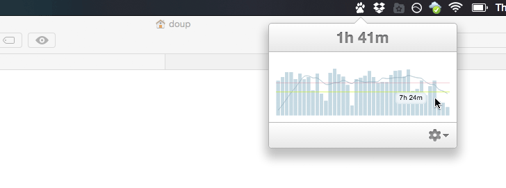

# Trackr

<a href="https://github.com/doup/trackr/releases"></a>



Trackr is a small tray application for OSX which tracks the uptime of the user and shows some simple statistcis. It's written on top of [Electron](http://electron.atom.io) using web technologies.

The tracking data is stored in `~/.trackr/uptime`. If you want to change the thresholds (green/red lines) just change `~/.trackr/uptime/thresholds.json` and add a new entry, e.g.:

``` json
{
    "2014-01-01": {
        "lower": 7,
        "upper": 9
    },
    "2015-04-10": {
        "lower": 5,
        "upper": 7
    }
}
```

Once the thresholds are exceeded a notification will pop-up regularly with a quote about time. You can switch off the notifications in the settings (cog) menu.

## Development

Install:

    $ npm install
    $ bower install

Develop:

    $ gulp

Build a release:

    $ gulp build

Update the icon:

1. Update icon-1024.png
2. Run `create-icns.sh`
3. Build `gulp build`

## License

The MIT License (MIT)

Copyright (c) 2015 Asier Illarramendi <asier@illarra.com>

Permission is hereby granted, free of charge, to any person obtaining a copy
of this software and associated documentation files (the "Software"), to deal
in the Software without restriction, including without limitation the rights
to use, copy, modify, merge, publish, distribute, sublicense, and/or sell
copies of the Software, and to permit persons to whom the Software is
furnished to do so, subject to the following conditions:

The above copyright notice and this permission notice shall be included in all
copies or substantial portions of the Software.

THE SOFTWARE IS PROVIDED "AS IS", WITHOUT WARRANTY OF ANY KIND, EXPRESS OR
IMPLIED, INCLUDING BUT NOT LIMITED TO THE WARRANTIES OF MERCHANTABILITY,
FITNESS FOR A PARTICULAR PURPOSE AND NONINFRINGEMENT. IN NO EVENT SHALL THE
AUTHORS OR COPYRIGHT HOLDERS BE LIABLE FOR ANY CLAIM, DAMAGES OR OTHER
LIABILITY, WHETHER IN AN ACTION OF CONTRACT, TORT OR OTHERWISE, ARISING FROM,
OUT OF OR IN CONNECTION WITH THE SOFTWARE OR THE USE OR OTHER DEALINGS IN THE
SOFTWARE.
